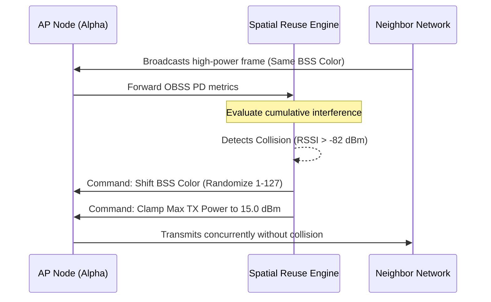

# Edge AI & Predictive Mathematical Models

The 802.11bn UHR Engine relies on simulated edge-compute artificial intelligence to maintain absolute link reliability. This document breaks down the mathematical logic used within the `InterferenceEngine` and `SpatialReuse` modules.

## The Forward-Pass Interference Model

The engine utilizes a lightweight, 1D-Convolutional approach to process historical telemetry. Because Wi-Fi 8 requires microsecond-level reactions, heavy deep learning models are unviable. Instead, we use rapid matrix multiplication against a rolling window of the last 100 microseconds of RF data.

### Activation Logic
The raw tensor aggregation is passed through a rapid Sigmoid activation function to generate a confidence score between `0.0` and `1.0`.

* **Input Data:** Channel Utilization (%) and Ambient Noise Floor (dBm).
* **Threshold:** A prediction score `> 0.75` triggers precognitive action.
* **Forecast:** The score is multiplied against a theoretical maximum delay (120ns) to dynamically instruct the `JitterBuffer` on how much memory to allocate for the upcoming transmission frame.

## Coordinated Spatial Reuse (CSR) Math

When Overlapping Basic Service Sets (OBSS) are detected, the system does not simply drop power. It utilizes an inverse square law adaptation combined with Signal-to-Noise Ratio (SNR) matrices to calculate the absolute maximum power it can broadcast without polluting the BSS Color space.

## Deterministic Frame Aggregation

To optimize the Sub-THz bridge, the MAC layer dynamically resizes A-MPDUs (Aggregated MAC Protocol Data Units).

- When the airspace is pristine and the ML model predicts zero jitter, the aggregator raises the frame cap to 1 Megabyte, creating massive, hyper-efficient data bursts.

- If jitter is predicted, the cap drops to 8 Kilobytes, shattering the payload into micro-frames to ensure a higher probability of successful error-checked delivery.
